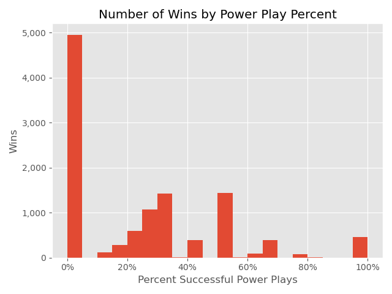
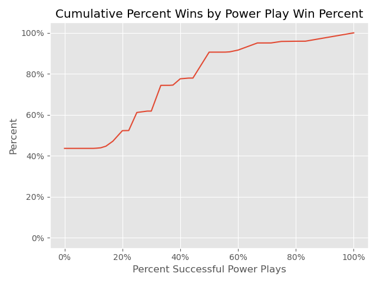
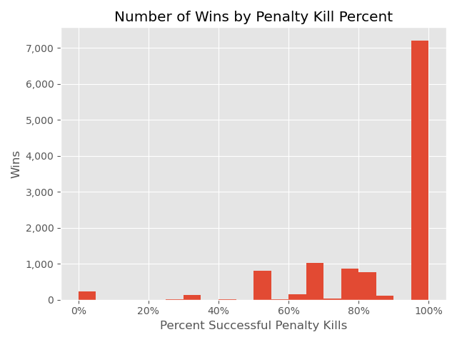
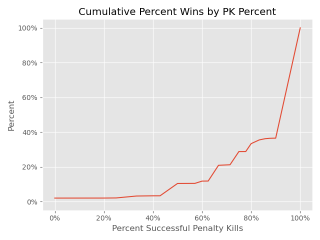
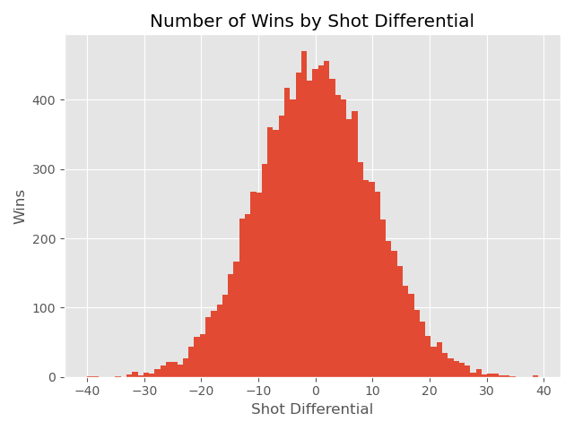
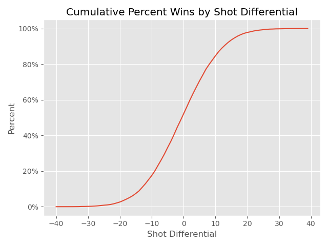
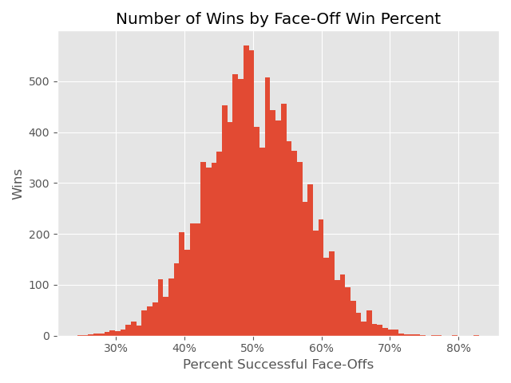
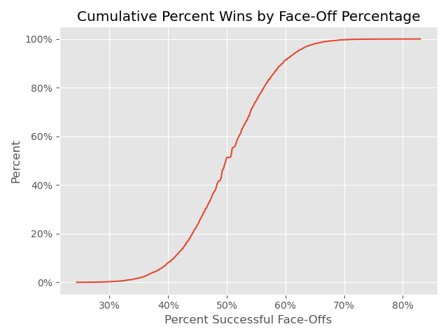

# Analysis of Regular Season Win Factors in the NHL

## Table of Contents
- [Background](#background)
- [Data](#data)
- [Exploratory Data Analysis](#exploratory-data-analysis)
- [Hypothesis Testing](#hypothesis-testing)
- [Future Analysis](#future-analysis)

## Background
The National Hockey League (NHL) is one of the four major professional sports organizations in North America. Like all sports organizations, the NHL has been hurt by the global COVID-19 pandemic. There has been lost revenue and lost interest in sports. However, as of early June 2021, North America appears to be making a recovery as more and more of the economy reopens. The economy opening up means sports leagues, like the NHL, can invite fans back to their stadiums when their seasons resume. However, with reopening comes a question: how will NHL teams bring fans back to stadiums and keep them engaged with their sport and team? The best way is by winning. Nothings brings in fans like winning. My goal is to answer what features reliably result in winning NHL regular season games.

## Data
The NHL provides game-level data through their [website](http://www.nhl.com/stats/teams). These data include 23 features such as team name, date of game, opponent, was the game a win or a loss, the type of win, and summary game statistics for games going back to the 1917 season. This analysis will focus on a 10 year period between the 2009-2010 and 2018-2019 seasons. This time period was examined to remove any impact the COVID-19 pandemic may have had on performance between the 2019 and 2020 seasons and because this is a recent enough sample to make claims about successful games in the near future.

The dataset for this project was scraped from the NHL website using [Selenium](https://www.selenium.dev/), [ChromeDriver](https://chromedriver.chromium.org/), and [BeautifulSoup](https://www.crummy.com/software/BeautifulSoup/bs4/doc/); raw data was stored in a MongoDB collection; and the processed data was stored in a PostgreSQL database. There are 23,444 records from the 10 year period.

| Field  | Description |
| ------------- | ------------- |
| Team  | Team name  |
| Game | Date, at or versus, and opponent |
| GP  | Games played |
| W  | Win |
| L  | Loss |
| T  | Tie |
| OT  | Overtime win |
| P  | Points |
| P%  | Point Percentage |
| RW  | Regulation win |
| ROW  | Regulation and overtime wins |
| S/O Win  | Shootout win |
| GF  | Goals for |
| GA  | Goals against |
| GF/GA  | Goals for by goals against |
| GA/GP  | Goals against by games played |
| PP%  | Power play percent |
| PK%  | Penalty kill percent |
| Net PP%  | Net power play percent |
| Net PK%  | Net penalty kill percent |
| Shots/GP  | Shots per game |
| SA/GP  | Shots against per game |
| FOW%  | Face-Off win percentage |

## Exploratory Data Analysis

### Power Play Percent Impact
Power plays are when one or more players from the opposing team are removed from play for a set period of time due to penalties and a team has a player advantage over their opponent. This is a prime opportunity to score and to potentially win a game. The power play percentage (PP%) metric measures how effective a team was during their power plays. A percentage of 100% means a team scored on every power play and a percentage of 0% means a team did not score on any power play.

The number of wins by power play percentage was examined after removing 221 records that did not have a power play percentage value. A missing power play percentage means the team did not have a power play that game. These records were removed because the impact of power plays cannot be assessed from these games. This examination produced interesting results.

About 40% of wins came from games where the percent of successful power plays was 0% and about 90% of all wins came from a power play percentage of 50% or less. These finds suggest that capitalizing on a power play, that is, scoring during a power play is not as important to winning as other factors.

### Penalty Kill Percent Impact
Penalty kills are when one or more players from a team are removed from play for a set period of time due ot penalties and the team has a player disadvantage compared to their opponent. These situations seem to be prime to lose a game. The penalty kill percentage (PK%) metric measures how effective a team was during penalty kills. 100% means a team prevented their opponent from scoring during each penalty kill situation and 0% means a team was scored on during every penalty kill situation.

The number of wins by penalty kill percentage was examined after removing 205 records that did not have a penalty kill percentage. These are games where a team was not in a penalty kill situation, and they were removed because the impact of penalty kills cannot be determined from these games.

These results seem to suggest that a higher penalty kill percentage results in more games won. About 60% of wins come when the penalty kill percentage is 100% and 65% of wins come when the penalty kill percentage is about 65% or higher.

These results compared with the power play results seem to suggest it is more important to prevent your opponent from scoring during a penalty kill then it is for a team to score during a power play.

### Shot Differential Impact
Shot differential is the number of times a team shot on their opponents goal minus the number of times an opponent shot on a team's goal. A larger differential means a team shot more on their opponents goal and a smaller differential means an opponent shot more on a team's goal.

No data was removed to conduct this analysis as all teams in all games have made at least one shot on goal during a game.

Interestingly, the shot differential distribution appears to be normally distributed, and most wins come when the shot differential is relatively close. This suggests that making more shots on your opponent does not necessarily mean a team will win a game.

### Face-Off Win Percent Impact
Face-off win percentage is the percent of times a team won a face-off during a game. Winning a face-off means that a team controls the puck and they can make shots on goal. A value of 100% means all face-offs were won by a team and a value of 0% means zero face-offs were won by a team.

No data was removed to conduct this analysis as all games start with a face-off, resulting in all games have a face-off percentage.

Interestingly, the percent face-off win distribution appears to be normally distributed, and most wins come when the face-off win percentage is around 50%. This suggests that winning more face-offs does not result in winning more games.

## Hypothesis Testing
After conducting the exploratory data analysis, the impact of penalty kills on a game was an interesting topic to explore further. It is reasonable to ask: do high-penalty games have a different win rate than low-penalty games?

While the number of penalty kill situations for a team is not in the dataset, this data is contained on the NHL website but would require additional web scraping. Before putting in the effort to retrieve this data, a preliminary analysis will be conducted with the available data to determine if this question is worth pursuing further.

The dataset contains penalty kill percentage and it is reasonable to assume that there are a finite and limited number of penalty kills during a game. From reviewing the [data](http://www.nhl.com/stats/teams?aggregate=0&report=penaltykill&reportType=game&seasonFrom=20092010&seasonTo=20182019&dateFromSeason&gameType=2&filter=gamesPlayed,gte,1&sort=timesShorthanded&page=0&pageSize=50) available on the NHL website, it appears the maximum number of penalty kill situations for all games between the 2009 and 2018 seasons was 12. Knowing the maximum denominator that could produce a penalty kill percentage for a given game, an estimate of the number of penalty kill situations can be estimated.

To conduct this estimate, percentages that had an indeterminate number of penalty kill situations were removed. Games where the penalty kill percentage was 0%, 50%, or 100% were removed due to too many combinations of numerators and denominators that could have produced these percentages. As a result, 15,290 records, about 65% of the dataset was removed, resulting in 8,154 games to use in the hypothesis test.

The remaining games were then labelled as 'high' or 'low' penalty kill games based on the estimated number penalty kills per game. Games with between 0 and 5 penalty kills were labelled as low and games with between 6 and 11 penalty kills were labelled as high.

The null and alternative hypotheses are given below.

| Hypothesis  | Definition |
| ------------- | ------------- |
| $H_0$  | There is no different in win rates between high and low penalty games.  |
| $H_a$  | There is a difference in the win rates between high and low penalty games.  |

## Future Analysis

